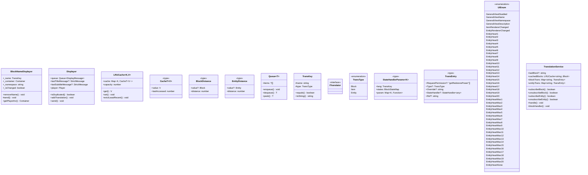

```mermaid
classDiagram
class BlockNameDisplayer{
            +_name: TransKey
+_container: Container
+_namespace: string
+_isChanged: boolean
            +removeName() void
#send() void
+getPlayerInv() Container
        }
class Displayer{
            +queue: Queue~DisplayMessage~
+lastTitleMessage?: StrictMessage
+lastSubtitleMessage?: StrictMessage
+player: Player
            +isDuplicated() boolean
+addTranslation() void
+send() void
        }
class LRUCache~K,V~{
            +cache: Map~K, CacheT~V~~
+capacity: number
            +get() V
+set() void
+evictLeastRecent() void
        }
class CacheT~V~ {
            <<type>>
            +value: V
+lastAccessed: number

        }
class BlockDistance {
            <<type>>
            +value?: Block
+distance: number

        }
class EntityDistance {
            <<type>>
            +value?: Entity
+distance: number

        }
class Queue~T~{
            +items: T[]
            +enqueue() void
+dequeue() T
+peek() T
        }
class TransKey{
            #name: string
#type: TransType
            +equals() boolean
+toString() string
        }
class ITranslator {
            <<interface>>


        }
class TransType {
        <<enumeration>>
        Block
Item
Entity
      }
class StateHandlerParams~K~ {
            <<type>>
            +lang: TransKey
+states: BlockStateMap
+param: Map~K, Function~

        }
class TransEntry {
            <<type>>
            +RequestPermission?: "getRedstonePower"[]
+Type?: TransType
+Override?: string
+StateHandler?: StateHandler~any~
+Ref?: string

        }
class UIEnum {
        <<enumeration>>
        GeneralViewDisabled
GeneralViewName
GeneralViewNamespace
GeneralViewDescription
ItemRendererChanged
EntityRendererChanged
EntityHeart1
EntityHeart2
EntityHeart3
EntityHeart4
EntityHeart5
EntityHeart6
EntityHeart7
EntityHeart8
EntityHeart9
EntityHeart10
EntityHeart11
EntityHeart12
EntityHeart13
EntityHeart14
EntityHeart15
EntityHeart16
EntityHeart17
EntityHeart18
EntityHeart19
EntityHeart20
EntityHeartMax1
EntityHeartMax2
EntityHeartMax3
EntityHeartMax4
EntityHeartMax5
EntityHeartMax6
EntityHeartMax7
EntityHeartMax8
EntityHeartMax9
EntityHeartMax10
EntityHeartMax11
EntityHeartMax12
EntityHeartMax13
EntityHeartMax14
EntityHeartMax15
EntityHeartMax16
EntityHeartMax17
EntityHeartMax18
EntityHeartMax19
EntityHeartMax20
EntityHeartAlone
      }
class TranslationService{
            +lastBlock?: string
+cachedBlocks: LRUCache~string, Block~*
+blockTrans: Map~string, TransEntry~*
+entityTrans: Map~string, TransEntry~*
            +subscribeBlock() boolean
+unsubscribeBlock() boolean
+subscribeEntity() boolean
+unsubscribeEntity() boolean
+handle() void
+blockHandler() void
        }
```
